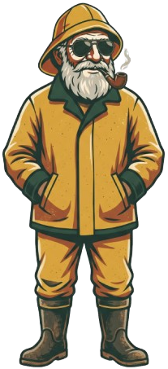

<div align="center">
  

# Fråga Fiskargubben

**Ask the old fisherman where the fish are biting.**

</div>

A fishing-advice chatbot for Swedish lakes. You're **standing at the water** and ask
*how* to fish — the app names your lake and the time, gathers open environmental
data, distills it into fishing-relevant **Signals**, and Claude turns those into
concrete, actionable advice (technique, lure, which shore) in a consistent persona —
*Fiskargubben*, the old fisherman.

---

## TL;DR

- **You ask** → "Hur ska jag fiska i Åsunden, Ulricehamn ikväll 20:00?"
- **Gubben answers** → "Fiska långsamt med en mörk jigg i skymningen. Ta östra
  stranden — vinden trycker in betet där." *(concrete: technique + lure + shore,
  because the app looked up light window, wind direction, water colour,
  air temperature…)*
- You don't state the conditions — the app fetches them (air temp, wind, pressure
  from SMHI) from the lake + time alone. **Skip the time and it uses now** — you're
  usually standing at the water.
- The app **resolves the lake** (from a pre-imported national register), **fetches
  live weather**, **reads pre-seeded water/fish data**, and **computes Signals**.
- Claude (**Sonnet**) writes the first answer; cheap follow-ups use **Haiku** over a
  frozen snapshot.
- Two data modes: **ETL = seeded once into Postgres** (lakes, stations, depth,
  colour, species). **Live = fetched per request** (SMHI weather). **Computed = no
  external call** (water temp, light window, trends).

## Stack

Next.js 16 · TypeScript · PostgreSQL + Drizzle · Better Auth (Google/Microsoft) ·
Anthropic SDK (Claude) · Vitest · Biome · pnpm

## How data flows

```
                     ┌─────────────── ETL (seeded once → Postgres) ───────────────┐
  pnpm etl:svar  →  lakes            (VISS: ~7 250 Swedish lakes, the join key)
  pnpm etl:metobs-stations → metobs_station  (SMHI weather-station index)
  pnpm etl:depth →  lake_depth       (SLU NORS: max depth)
  pnpm etl:mvm   →  water_colour     (SLU MVM: brown/clear + Secchi sight depth)
  pnpm etl:aqua  →  lake_species     (SLU NORS: fish species per lake)
                     └────────────────────────────────────────────────────────────┘

  Request:  POST /api/ask  "how should I fish <lake> at <time>?"
     │
     ├─ 1. Identity + gates      (session / anon 1-prompt quota / chat-turn limit)
     ├─ 2. Extract  (Claude Haiku)  → { onTopic, lakeName, time, intent }   ← off-topic = refuse
     ├─ 3. Resolve lake         (DB read: lakes)
     ├─ 4. Build Signals ───────────────────────────────────────────────────┐
     │        LIVE    → SMHI forecast (getForecast, 1h cache) + metobs obs   │
     │        DB read → depth, colour, species, nearest station              │
     │        COMPUTED→ water-temp estimate, light window, windward shore,   │
     │                  pressure/temp trends, species comfort                │
     │      └──────────────────────────────────────────────────────────────┘
     ├─ 5. Spend credit          (DB write, atomic)
     └─ 6. Advise  (Claude Sonnet, streamed)   → follow-ups reuse frozen Signals via Haiku
```

**Signals** = the compact, code-computed object the LLM reasons over (it never sees
raw API payloads): air temp/pressure/wind, pressure & 5-day temp trends, windward
shore, cloud, water temp/colour/sight/max-depth, light window, species present +
comfort. Each value carries provenance (`forecast|observed|modeled|estimated` ×
`high|low`); missing sources are simply omitted (graceful degradation).

### ETL (one-time seed) vs Runtime (per request)

| | What | Source | When |
|---|---|---|---|
| **ETL** | lakes, stations, depth, water colour, species | VISS + SMHI + SLU (NORS/MVM) | Seeded once, re-seed periodically. Idempotent upserts. **Never on the request path.** |
| **Live** | weather forecast + past-time observations | SMHI (metfcst / metobs) | Every request; forecast cached 1 h per lake. |
| **Computed** | water-temp estimate, light window, windward shore, trends, species comfort | pure functions | Every request; no external call. |

> Water temperature has **no live API** (only manual Excel), so it is always the
> code estimate (`estimated`/`low`) — see [ADR-0006](docs/adr/0006-no-live-lake-water-temperature-source.md).
> A natural future extension: let the angler supply a reading from their sonar/ekolod
> ("vattnet är 18°" ) and use that over the estimate — the extractor doesn't capture
> it yet.

## The Claudes

| Model | Role | When | Cost |
|---|---|---|---|
| `claude-haiku-4-5` | extractor + topic gate + follow-up advice | every turn / follow-ups | cheap |
| `claude-sonnet-4-6` | first-answer advice | once per conversation | 1 credit |

## Run it

```bash
pnpm install
cp .env.example .env          # fill DATABASE_URL, ANTHROPIC_API_KEY, auth secrets, VISS_APIKEY, MVM_TICKET
pnpm db:migrate               # apply schema (needs pg_trgm for lake typeahead)
pnpm etl:svar                 # seed lakes FIRST, then the rest (idempotent, re-runnable):
pnpm etl:metobs-stations && pnpm etl:depth && pnpm etl:mvm && pnpm etl:aqua
pnpm dev                      # http://localhost:3000
```

ETL scripts auto-load `.env`. `svar` must run first — every other source joins the
`lakes` table it seeds. Details: [`scripts/etl/README.md`](scripts/etl/README.md).

## Commands

`pnpm dev` · `pnpm build` · `pnpm test` · `pnpm ts:check` · `pnpm biome` ·
`pnpm db:migrate` · `pnpm etl:*`

## Docs

- Architecture decisions: [`docs/adr/`](docs/adr/) — static-vs-live sources
  ([0002](docs/adr/0002-static-sources-pre-imported-only-forecast-live.md)),
  model split ([0003](docs/adr/0003-two-model-split-haiku-extract-sonnet-advise.md)),
  no-live-water-temp ([0006](docs/adr/0006-no-live-lake-water-temperature-source.md)).
- Domain model + terminology: [`CONTEXT.md`](CONTEXT.md)
- ETL runbook: [`scripts/etl/README.md`](scripts/etl/README.md)
